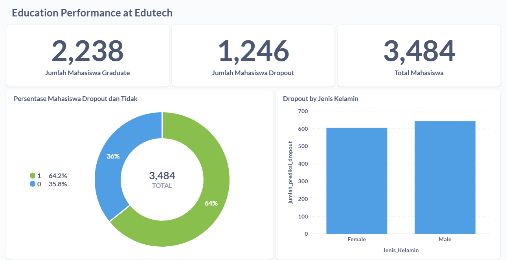
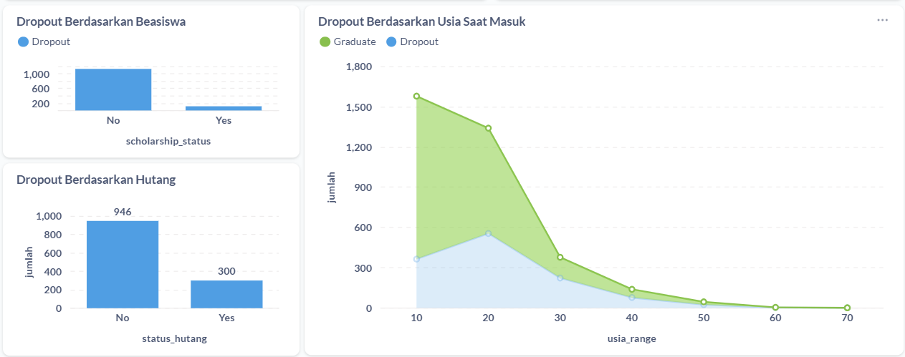
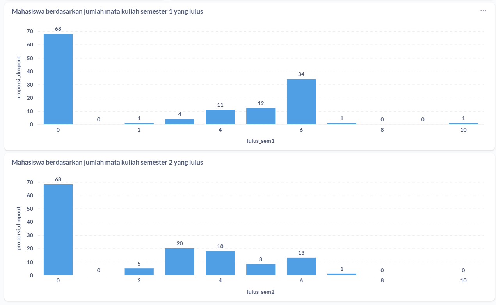

# Proyek Akhir: Menyelesaikan Permasalahan Perusahaan Jaya Jaya Maju

## Business Understanding

Jaya Jaya Institut merupakan salah satu institusi pendidikan perguruan yang telah berdiri sejak tahun 2000. Hingga saat ini ia telah mencetak banyak lulusan dengan reputasi yang sangat baik. Akan tetapi, terdapat banyak juga siswa yang tidak menyelesaikan pendidikannya alias dropout.

Jumlah dropout yang tinggi ini tentunya menjadi salah satu masalah yang besar untuk sebuah institusi pendidikan. Oleh karena itu, Jaya Jaya Institut ingin mendeteksi secepat mungkin siswa yang mungkin akan melakukan dropout sehingga dapat diberi bimbingan khusus.

### Permasalahan Bisnis
Tingkat dropout mahasiswa di Jaya Jaya Institut tergolong tinggi, yang dapat:
- Menurunkan reputasi institusi.
- Mempengaruhi akreditasi dan kepercayaan publik.
- Menyebabkan kerugian finansial (hilangnya pemasukan dari mahasiswa).
- Membebani proses akademik dan administrasi.

### Cakupan Proyek
Proyek ini bertujuan untuk membantu Jaya Jaya Institut dalam mendeteksi dan memonitor risiko mahasiswa dropout sejak dini dengan memanfaatkan machine learning dan visualisasi data interaktif. Proyek ini mencakup:
- Memprediksi kemungkinan dropout mahasisea berdasarkan data historis akademik dan non akademik.
- Menyediakan dashboard interaktif untuk monitoring dan pengambilan keputusan oleh pihak institusi.
### Cakupan Fungsional Proyek
1. Pengolahan Data Mahasiswa
   - Pembersihan dan normalisasi data akademik dan keuangan mahasiswa.- - Transformasi fitur kategorikal dan numerik untuk keperluan model.
2. Model Prediksi Dropout
   - Training model prediksi (SVM) menggunakan data historis.
   - Penyimpanan model dan scaler dalam bentuk .joblib untuk inferensi.
3. Antarmuka Prediksi(Stremlit)
   - Form interaktif untuk input data mahasiswa baru.
   - Hasil prediksi dropout ditampilkan secara real-time.
4. Dashboard Monitoring Dropout
   - Visualisasi statistik jumlah dropout berdasarkan berbagai faktor:
        - Jumlah mata kuliah lulus.
        - Status beasiswa, hutang, dan pembayaran.
        - Jenis kelamin dan usia saat mendaftar.
   - Tampilan daftar mahasiswa dengan risiko dropout tinggi.
5. Data disimpan di PostgreSQL untuk integrasi dengan dashborad
6. Integrasi dengan Metabase

### Persiapan
| Jenis      | Keterangan                                                                 |
|------------|------------------------------------------------------------------------------|
| Title      | Jaya Jaya Institut                                                   |
| Source     | [github](https://github.com/dicodingacademy/dicoding_dataset/tree/main/students_performance) |
| Visibility | Public                                                                      |

Setup environment:

### 1. Buat Conda Environment

```bash
conda create -n education-performance python=3.10 -y
conda activate education-performance
```

### 2. Install Dependensi

```bash
pip install -r requirements.txt
```
Setup environment docker
### 1. Clone Repository

```bash
git clone https://github.com/Sintasitinuriah/education-performance.git
cd education-performance
```

### 2. Siapkan `docker-compose.yaml`

Pastikan file `docker-compose.yaml` sesuai dengan struktur folder ini.

### 3. Jalankan Docker Compose

```bash
docker-compose up -d
```

### 4. Akses Metabase

Buka browser dan akses:

```
http://localhost:3000
```

### 5. Hentikan Docker

```bash
docker-compose down
```
### Menjalankan Aplikasi Streamlit

```bash
streamlit run pred_dropout.py
```

# Data Understanding
Dataset ini berisi informasi akademik, administratif, dan demografis mahasiswa. Dimana kolom yang dijelaskan pada bagian ini adalah yeng mempunyai korelasi tinggi terhadap keputusan dropout.

| Kolom                               | Deskripsi                                                                 |
|------------------------------------|---------------------------------------------------------------------------|
| `Application_mode`                 | Jalur pendaftaran mahasiswa (numerik yang merepresentasikan mode tertentu) |
| `Gender`                           | Jenis kelamin (1 = Laki-laki, 0 = Perempuan)                             |
| `Age_at_enrollment`               | Usia mahasiswa saat mendaftar (dalam tahun)                              |
| `Debtor`                           | Status hutang pendidikan (1 = Ya, 0 = Tidak)                              |
| `Scholarship_holder`              | Status penerima beasiswa (1 = Ya, 0 = Tidak)                              |
| `Tuition_fees_up_to_date`         | Apakah pembayaran SPP tepat waktu (1 = Ya, 0 = Tidak)                     |
| `Curricular_units_1st_sem_approved` | Jumlah mata kuliah yang lulus di semester 1                             |
| `Curricular_units_1st_sem_grade`  | Nilai rata-rata semester 1                                               |
| `Curricular_units_2nd_sem_approved` | Jumlah mata kuliah yang lulus di semester 2                             |
| `Curricular_units_2nd_sem_grade`  | Nilai rata-rata semester 2                                               |
| `Status`                           | Status akhir mahasiswa (1 = Graduate, 0 = Dropout, 2=Enroll)                        |

## 1. Bivariate - EDA
Pada bagian ini diberikan visualisasi antara dua komponen menggunakan crosstab, scatterplot dan bosplot
## 2. Multivariate - EDA
pada bagian ini diberikan visualisasi antara beberapa komponen yang saling berkiatan menggunakan Marix Korelasi, Pairplot dan Violinplot
## 3. Pengecekan Missing Values, Duplicated dan Outliers
- Dataset ini tidak memiliki missing value
- Dataset ini tidak memiliki data yang duplikat 
- Dataset memiliki outliers dan visualisasikan dengan boxplot
# Data Preparation

## 1. Mengatasi Outliers
Outliers adalah nilai ekstrem yang jauh dari distribusi umum data. Kehadiran outliers dapat mengganggu proses pelatihan model, terutama dalam algoritma yang sensitif terhadap distribusi data. Mengurangi distorsi pada statistik dan model yang dihasilkan, serta meningkatkan stabilitas dan akurasi model. pada model ini menggunakan pendekatan Interquartile Range (IQR). IQR merupakan metode statistik yang mengukur sebaran tengah data dan mengidentifikasi nilai-nilai yang berada jauh di luar rentang normal

## 2. Encoding Data Kategorikal
Beberapa fitur dalam dataset bersifat kategorikal (bukan numerik), seperti `Status` agar fitur ini dapat digunakan oleh algoritma machine learning (yang umumnya hanya menerima input numerik), dilakukan proses encoding, yaitu mengubah nilai kategorikal menjadi numerik. 

## 3. Seleksi Fitur (Feature Selection)
Seleksi fitur adalah proses memilih subset dari fitur yang paling relevan terhadap target. Terlalu banyak fitur yang tidak penting dapat menyebabkan overfitting. Meningkatkan performa model, mengurangi waktu pelatihan, dan mencegah kompleksitas berlebih yang dapat menurunkan generalisasi model. Pada Selection Feature ini diambil dengan menghitung nilai korelasi tertinggi.

Fitur terpilih: ['Curricular_units_2nd_sem_approved', 'Curricular_units_2nd_sem_grade', 'Curricular_units_1st_sem_approved', 'Curricular_units_1st_sem_grade', 'Tuition_fees_up_to_date', 'Scholarship_holder', 'Application_mode', 'Gender', 'Debtor', 'Age_at_enrollment']

## 4. Splitting Data
Splitting data adalah proses membagi dataset menjadi data pelatihan dan data pengujian. Ini penting untuk mengevaluasi kinerja model secara adil.Untuk memastikan bahwa performa model diuji pada data yang belum pernah dilihat, sehingga mencerminkan kemampuannya dalam generalisasi.

## 4. Standarisasi
Standarisasi adalah proses menyamakan skala dari fitur-fitur numerik. Banyak algoritma machine learning bekerja optimal ketika fitur memiliki skala yang seragam. Meningkatkan kinerja dan konvergensi algoritma yang sensitif terhadap skala, seperti KNN, SVM, dan PCA.

## 6. SMOTE (Synthetic Minority Over-sampling Technique)
SMOTE adalah teknik untuk mengatasi masalah ketidakseimbangan kelas dengan membuat data sintetis dari kelas minoritas melalui interpolasi. Berfungsi untuk meningkatkan kemampuan model dalam mempelajari pola dari kelas minoritas, yang sering kali terabaikan dalam data tidak seimbang.


# Model Development
## Support Vector Classifie (SVC)
**Support Vector Classifier (SVC)** adalah bagian dari algoritma **Support Vector Machine (SVM)** yang digunakan untuk **klasifikasi data**. Tujuannya adalah mencari sebuah *hyperplane* (garis atau bidang pemisah) yang dapat **memisahkan dua kelas data dengan margin terbesar**.

### Cara Kerja SVC
SVC bekerja dengan mencari hyperplane terbaik yang memisahkan data berdasarkan labelnya (contoh: dropout vs tidak dropout). SVC memilih hyperplane yang memaksimalkan margin, yaitu jarak antara hyperplane dan titik data terdekat dari masing-masing kelas (disebut *support vectors*).

Dalam proyek ini, digunakan:
- **Linear Kernel**: Artinya, SVC mencari garis lurus atau bidang datar sebagai pemisah. Ini cocok digunakan ketika data dapat dipisahkan secara linear.

### Kelebihan SVC
- **Akurasi tinggi** dalam data berdimensi tinggi.
- **Efisien dalam kasus data kecil hingga sedang.**
- Mampu menangani **masalah klasifikasi biner** dengan baik (seperti Dropout vs Graduate).

----
# Evaluation
## Clasification Report
**Classification Report** adalah ringkasan metrik evaluasi untuk model klasifikasi. Laporan ini memberikan wawasan tentang kinerja model dengan membandingkan label yang diprediksi terhadap label sebenarnya.
Classification Report biasanya mencakup metrik berikut untuk setiap kelas:

| **Metrik**  | **Deskripsi**                                                                                   |
|-------------|--------------------------------------------------------------------------------------------------|
| **Precision** | Proporsi prediksi positif yang benar-benar benar (True Positive / (True Positive + False Positive)) |
| **Recall**    | Proporsi data positif yang berhasil diprediksi dengan benar (True Positive / (True Positive + False Negative)) |
| **F1-score**  | Rata-rata harmonis dari precision dan recall, berguna saat ingin seimbangkan keduanya          |
| **Support**   | Jumlah kemunculan aktual dari masing-masing kelas dalam data                                   |

**Hasil Classification SVC** pada model ini adalah sebagai berikut:

                    precision    recall  f1-score   support

            0          0.88      0.81      0.85       274
            1          0.89      0.93      0.91       423

        accuracy                           0.88       697
        macro avg      0.88      0.87      0.88       697
        weighted avg   0.88      0.88      0.88       697

## Business Dashboard




Untuk mempermudah pemantauan dan analisis  performa siswa secara berkala, telah dibuat sebuah dashboard interaktif menggunakan Metabase. Dashboard ini menyajikan visualisasi data yang intuitif dan informatif mengenai faktor-faktor yang mempengaruhi performa siswa, seperti:

- Distribusi perfroma siswa berdasarkan beasiswa, Gender, hutang, dan lulus matakuliah.
- Faktor mempengaruhi dropout seperti nilai, usia, kelulusan mata kuliah, beasiswa dan hutang/tunggakan.

Dashboard pada gambar di atas hanya dapat diakses di lingkungan lokal proyek saja. sehingga penjelasan dashboard ada pada video sintastnrh-video.mp4

## Solusi Machine Learning
Solusi machine learning ini dikembangkan sebagai alat bantu awal bagi Jaya Jaya Institut untuk memprediksi kemungkinan dropout mahasiswa berdasarkan data historis akademik dan administratif.

Aplikasi dibangun menggunakan Streamlit dan berfungsi sebagai dashboard interaktif sederhana yang memiliki dua fitur utama:

    - Prediksi Status Mahasiswa (Dropout / Graduate)

    - Pengguna dapat memasukkan data individual mahasiswa melalui form input.

    - Model prediksi menggunakan algoritma Support Vector Machine (SVM) dengan kernel linear.
    
    - Output yang ditampilkan berupa status: Dropout atau Graduate.

**Visualisasi dari Data CSV yang Diunggah**
Pengguna dapat mengunggah file .csv berisi data banyak mahasiswa.
Dashboard akan menampilkan dua visualisasi:

    - 📊 Distribusi Dropout Berdasarkan Jumlah Mata Kuliah Lulus Semester 1

    - 📊 Proporsi Dropout Berdasarkan Status Beasiswa

Visualisasi ini memberikan insight awal terkait karakteristik umum dari mahasiswa dropout, khususnya dari segi akademik dan bantuan keuangan.

🎯 Akses aplikasi online: [pred_app](https://education-performance.streamlit.app/)

## Conclusion
Melalui analisis dan implementasi model prediksi dropout menggunakan algoritma Support Vector Classifier (SVC), proyek ini berhasil mengidentifikasi faktor-faktor penting yang memengaruhi kemungkinan mahasiswa untuk tidak menyelesaikan studinya.

Beberapa temuan utama:
1. Mahasiswa dengan jumlah mata kuliah yang lulus lebih sedikit, terutama di semester pertama, memiliki risiko lebih tinggi untuk dropout.
2. Status keuangan juga berpengaruh: mahasiswa yang tidak membayar uang kuliah tepat waktu atau memiliki status debtor cenderung memiliki proporsi dropout yang lebih tinggi.
3. Faktor seperti status beasiswa, jenis kelamin, dan usia saat pendaftaran juga memberikan pengaruh signifikan terhadap hasil prediksi.

Dengan visualisasi dan dashboard interaktif, institusi seperti Jaya Jaya Institut dapat:
1. Melakukan pemantauan real-time terhadap potensi dropout mahasiswa.
2. Memberikan intervensi dini atau bimbingan akademik secara proaktif.
3. Menyusun kebijakan berbasis data untuk meningkatkan angka kelulusan dan kualitas pendidikan.

Secara keseluruhan, sistem ini dapat menjadi alat bantu strategis dalam mendukung pengambilan keputusan berbasis data demi menciptakan lingkungan pendidikan yang lebih baik dan inklusif.


### Rekomendasi Action Items
Beberapa rekomendasi item aksi yang dapat diterapkan oleh Jaya-jaya Institut, adalah sebagai berikut:
1. Pemantauan Rutin Performa Akademik Awal
   Fokus pada mahasiswa dengan jumlah mata kuliah lulus rendah di semester pertama (≤10). Mereka memiliki potensi lebih tinggi untuk dropout.
2. Program Intervensi Dini
   Buat program pendampingan atau bimbingan belajar untuk mahasiswa dengan nilai rendah atau progres akademik lambat, terutama pada semester 1–2.
3. Pemetaan Risiko Dropout Secara Berkala
   Implementasikan dashboard prediksi dropout agar pihak akademik dapat memonitor mahasiswa dengan risiko tinggi secara real-time.
4. Peninjauan Kebijakan Keuangan
   Identifikasi mahasiswa yang menunggak pembayaran atau berstatus debtor. Sediakan opsi pembayaran yang fleksibel atau beasiswa tambahan untuk mengurangi tekanan finansial.
5. Evaluasi Efektivitas Beasiswa
   Lakukan analisis mendalam terhadap pengaruh status beasiswa terhadap dropout. Jika efektif, pertimbangkan perluasan cakupan beasiswa bagi kelompok berisiko.

